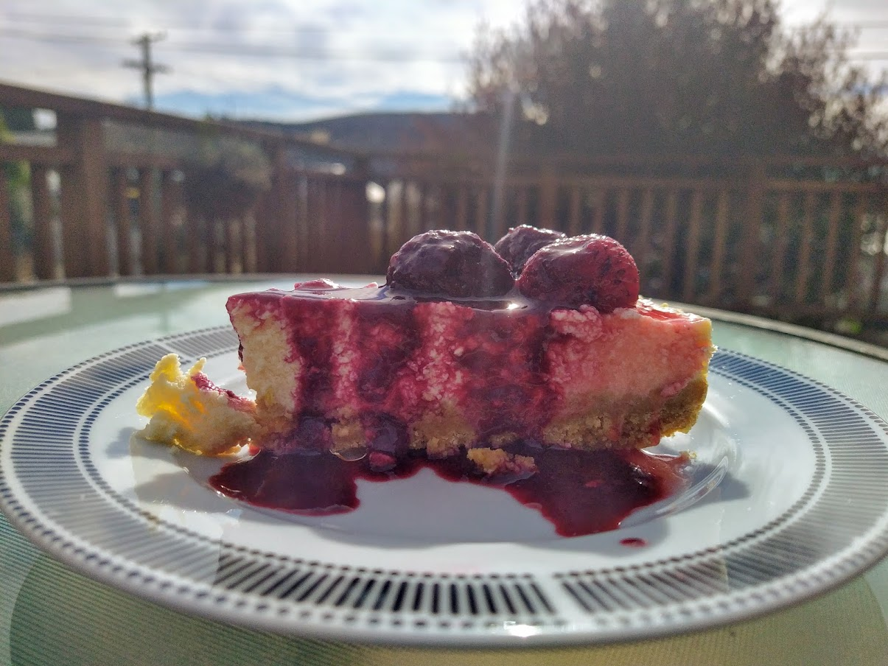

Cheesecake is tasty, but rather heavy desert made from cream cheese (I prefer quark). It is also surprisingly easy and quick to make! There are a few tricks, however, as cheesecakes tend to break if you don't treat them well.

First of all, bubbles. They are the weak points that cause cake to rupture. Get rid of all the bubbles! Unlike with normal cakes, where bubbles and all the air that you manage to trap in the batter before baking, makes the cake lighter and more desirable, here the bubbles are your biggest enemy! Gently mix your cake, if you need to use food processor or hand mixer, use the lowest speed. You probably need to use one as cream cheese is quite thick and hard to mix by hand (unlike quark).

Another trick is to use water bath. You essentially bake your cake in water. This helps mediate the cooking process (under normal conditions, the temperature of water cannot go over 100°C), prevents over baking and drying of the cake. If you don't have large enough tray, just put a tray of filled with water in the oven, the steam still helps.

There is also the tiny bit of flour. It makes the cake less smooth, but it helps against breaking. If you believe in yourself, leave it out. Finally, don't touch your cake, leave it slowly cool down. If you touch the surface, it will break.

Even if your cake breaks, nothing is lost. You can mask the rupture by putting fruit on top, covering the cake with syrup or some creative cutting, such as into by cutting he cake into bite-size cubes.

The cream cheese I am using comes in 250 g packets, so I use two of them and 100 g of yogurt. Works well.

## Cheesecake

### Ingredients

#### Base
* 300 g plain biscuits
* 150 g butter

#### Filling
* 600 g cream cheese
* 175 g sugar
* 3-4 eggs
* 30 g flour (optional)
* lemon zest (optional)
* lemon juice (optional)
* vanilla (optional)

### Directions

#### Base
* (optional) Wrap your spring form with a tin foil to make it waterproof.
* In a food processor, grind biscuits and then add diced butter, don't let it sit in room temperature for long, straight from fridge is fine.
* Lay round form with baking paper and pack the buttered biscuits with a cup or a glass, until you have a nice solid layer.

#### Filling
* In a food processor, combine cream cheese, sugar, flour, flavours and eggs, mix on the slowest speed. Unlike with other cakes, you don't want to get any air into your mix, air is the enemy. Optionally, you could combine the ingredients by hand, but cream cheese is often quite solid brick. So use your food processor for cream cheese and sugar and mix in eggs and other ingredients by hand.
* Drop the bowl, gently, several times on table to get out all bubbles.
* Pour the mixture into your form. Drop it again and leave it sit for a while (5 minutes) to get rid of all air bubbles.

#### Baking
* preheat oven to 160°C

Now you have a few options:

* **Water Bath**
  - Put into oven a high tray/large spring pan that fits your spring pan
  - Boil enough water that the spring pan with cheesecake can be about halfway submerged in water
  - Once everything is preheated, put a cheesecake into the larger tray and fill it with boiling water.
  - Bath will gently bake the cake, prevent overbaking and drying of the cake, this will minimize any ruptures.
* **Steaming**
  - If you don't have large enough tray for your spring pan (my case), put a tray filled with water into the oven a bit before you put in the cheesecake.
  - Steaming will prevent drying of the cake.

* **Nothing**
  - That's why you put the flour in, right?

Bake for 30 minutes. After 30 minutes, try to shake with the cake, if the center is liquid, bake another 5 minutes and check again. If the cake is only little wobbly, its fine, stop the cooking process. Turn off the oven, open the oven door a bit and let everything gently cool down. Don't touch the cake or it will brake.
