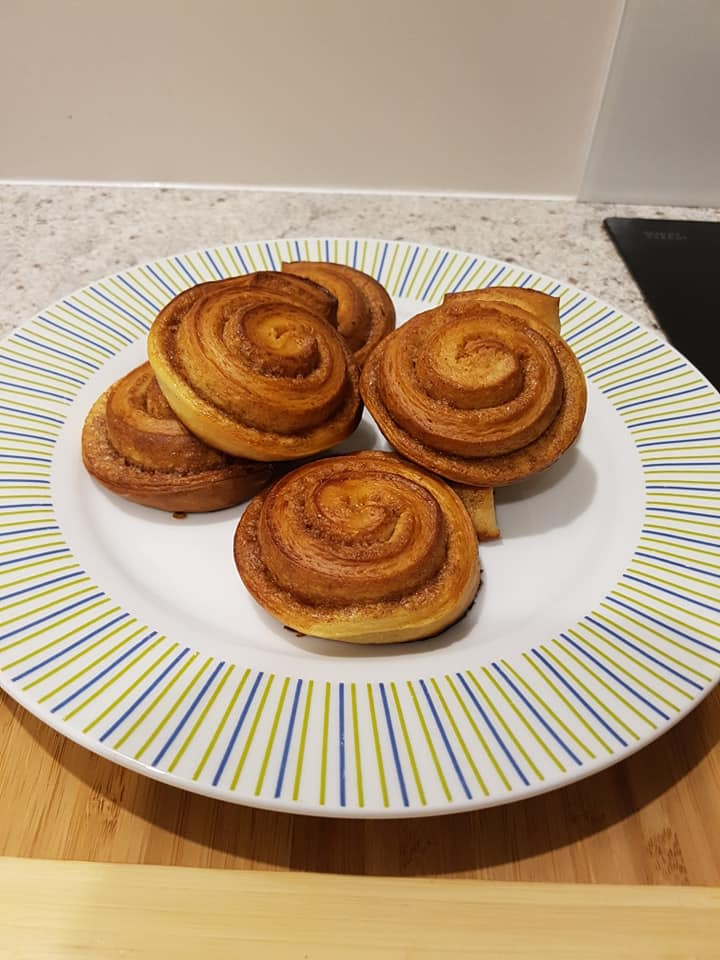

I love cinnamon so I was looking for a recipe with a lot of it. Cinnamon rolls came to my mind, they seem to be quite popular in English-speaking countries. But I didn't like those recipes, especially with the white thing poured on it. Fortunately, I have found this Swedish recipe with cardamom and it quickly became my favourite pastry. You can do so much with this! I have switched cardamom with nutmeg and ginger and tried to make it with coconut milk instead of normal milk!

You can choose if you want to have them as individual pieces, this way they will be a bit dryer and harder, or if you want your rolls a bit soften, put them close together. This will trap some of the moisture.

### Ingredients

#### Dough
* 500 g of flour
* 250 g of milk
* 120 g of butter (melted)
* 120 g of sugar
* pinch of salt
* 10-20 g of yeast
* 2 teaspoons of cardamom or other spices (experiment!)

#### Filling
* 60 g of butter (melted)
* 60 g of sugar
* 2 teaspoons of cinnamon

#### Smear
* 1 beaten egg with some milk

### Directions
* make a starter with milk, a spoon of sugar, a spoon of flour and yeast
* add wet ingredients: melted butter, sugar, salt, cardamom (or other spices)
* add flour and work until smooth, let rise for an hour in a warm place
* work it gently to press out air and roll the dough into a big rectangle
* mix melted butter, sugar and cinnamon and spread it gently over dough
* roll the dough and cut into small individual rolls
* let the rolls rise for an hour, then smear with beaten egg
* pre-warm oven and bake for 15-30 minutes on about 160-180 degrees
