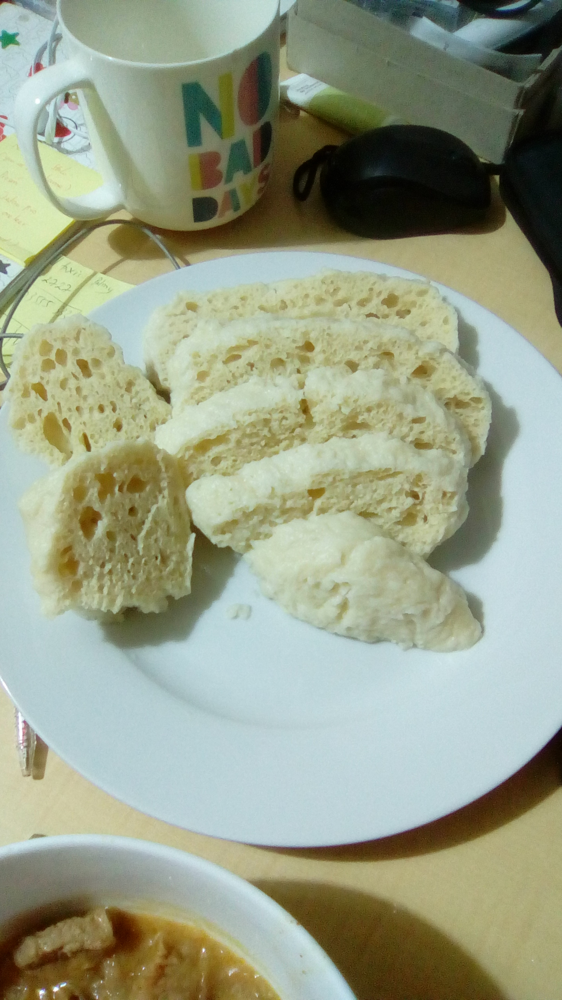

One of the most important Czech side. You will get it to many Czech sauces (such as sirloin, but also tomato sauce), with goulash, cabbage or even with baked chicken with a veggie (when the dumpling soaks all the sauce from that, yummy!).

The way you eat dumpling is by taking a small cut and then soaking it into the sauce. Don't take dumpling into your hand! (many foreigners do that)

You will notice that the recipe is quite similar to the [steamed dumplings](./steamed_dumplings.html).

## Bread dumpling

### Ingredients

* 300 g flour
* 150 ml milk
* 1 spoon of sugar
* 10-20 g of yeast
* 1 egg
* 1 teaspoon of sugar

### Directions

* Make starter (*kvásek*) from warm milk, a spoon of flour, a spoon of sugar and yeast. Leave it to grow for about 20 minutes in a warm place.
* Mix flour, salt with kvásek and add beaten egg. Mix well and work the dough with a wooden spoon until the dough is soft (it takes 10-20 minutes if done by hand). If the dough is too dry (those damn eggs are not the same all the time:P), you can add a little bit of warm water.
* When the dough is smooth, put it into a bowl, sprinkle some flour around it and leave it to rise for about an hour in a warm place.
* When the dough roughly doubled its volume, press it to get the air out, divide into halves and then form two small loaves/rolls. Leave about 20 minutes to rest.
* Take the biggest pot you have, fill with water so that dumplings could swim and add salt (spoon or two). When the water is boiling, reduce the heat a bit, add dumplings and cover with a lid. Boil about 20 minutes. Halfway through turn the dumplings around.
* After 20-25 minutes, remove the dumplings and put them on plate or desk to dry a bit. Water from the surface will evaporate and the surface will be less slimy.
* Cut into wheels and serve.
