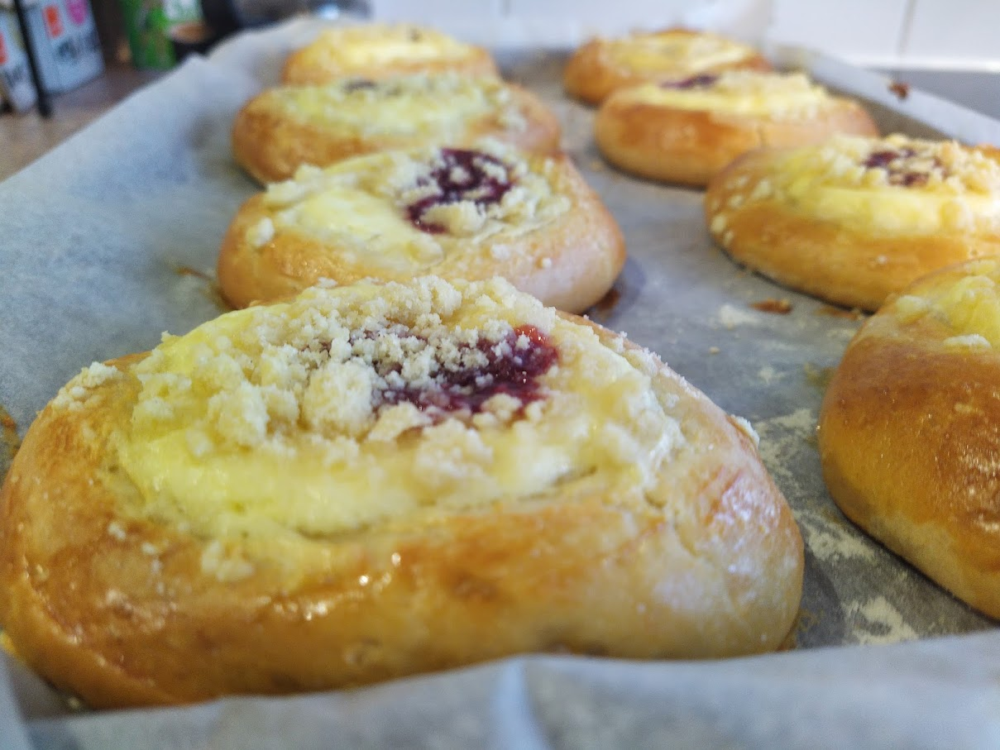

Koláče (from _kolo_, a wheel) are traditional Czech pastry. Imagine the combination of buttery dough with sweet fruity, nutty, or creamy filling. You can buy them everywhere in Czechia! But if you live abroad and you want one, you need to bake them yourself.

### Ingredients:

#### Dough
* 250 g flour
* 40 g sugar
* 80 g butter
* 125 ml milk
* 1 egg yolk
* salt
* yeast

#### Crumble

* 60 g flour
* 25 g butter
* 25 g icing sugar

### Directions:

* make starter from milk, yeast, a spoon of sugar, and a spoon of flour
* mix flour with salt, add sugar, melted butter, yolk, and prepared starter
* mix well, knead well, and let to proof in a warm spot for an hour
* divide into 8 or 16 equal parts, form into balls and leave to rest for 30 minutes
* using a cup or a glass, make an indent in the middle
* fill the indent with povidla, apple sauce, fruit preserve, quark, nut paste or other filling
* sprinkle with a good amount of crumble
* bake for ~15 minutes at 180°C, a bit more for larger koláče

#### Tips:

* You can't use jam, as jam contains high percentage of water and it would just boil out and make a mess. Use fruit preserve with a high pulp content.
* To make fruit preserve, like an apple sauce, just boil bunch of cleaned and chopped ripe apples with some suger until all the water boil out, and you get thick sweet fruity paste
* You can also make a filled dough, instead of forming a simple balls, fill them with your favourite filling, such as quark, and then continue as usual, making indent and filling the indent with another type of filling. Small koláče prepared this way are called Wedding koláče, and they are typically served on weddings.
