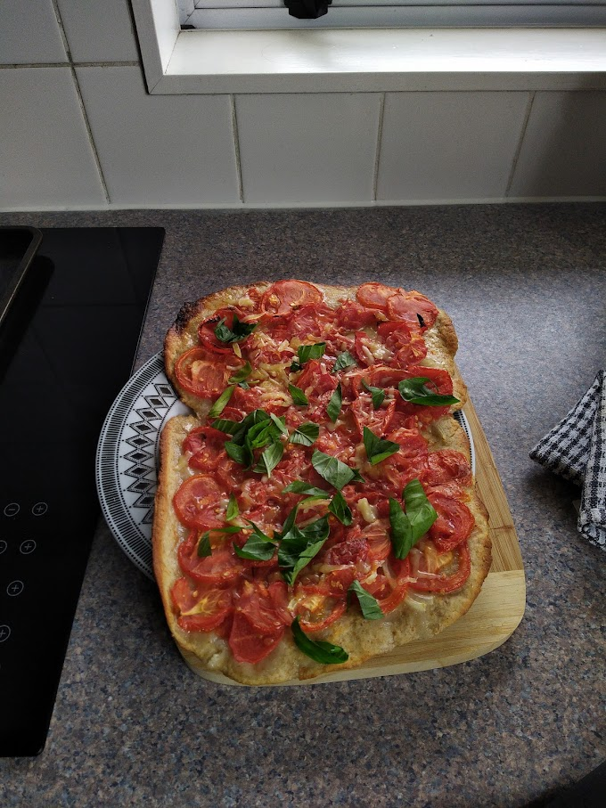

Pizza is essentially a savoury pie or bread with stuff on it. People argue which food-chain has the best cost-value, but I found out that the most tasties pizzas are those you make at home, and it will be ready in about the same time.

### Ingredients

* 180 ml water
* 1 spoon of sugar
* 1 spoon of yeast
* 1 teaspoon of salt
* 1 spoon of olive oil
* 250 g of flour

### Directions
* prepare starter from water, yeast, sugar and bit of flour
* mix everything in a large bowl and knead until smooth
* rise for a few minutes, half an hour is good, but with good yeast even 10 minutes should be enough, pizza is quite thin after all
* roll pizza, cover tomato sauce and topings
* bake at 200 to 220 C for 20-30 minutes

### Tips

* too many wet topings prolonge the baking time, consider pre-baking the pizza before putting ingredients
* the thinner the pizza, the faster the baking time
* baking time will depend on your oven, the position where you put pizza, temperature, program, and your preferences for crispiness. Experiment for best results.
