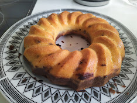

Bábovka or Bundt cake is a traditional central-european cake. Its so old, first documented during 15. century, that the etymology is unknown, it comes from the name of the baking form *Bába*, but there the trace ends. Some theories suggest that the word is derived from the word for grandmother/old woman as either something they baked or as a gift to midwifes. Other suggest that it comes from baby speech word for eating *papi*.

But enough history. Bábovka is a cake that is traditionally eaten with tea or coffee, something you offer to visitors. Or just something you have on your table if you want to look a bit fancy. There are plenty of different recipes, but most of them share marbling, when you divide the dough/batter and mix cocoa into one part before layering into the form. Given that the dough or batter is on the liquid side, Bábovka or Bundt cake requires specific form, without it the cake won't bake properly and you will have it burnt on the outside while still raw on the inside.

This recipe uses quark, I have raved about quark before, so I will not do it again. Quark gives the cake very nice flavour and texture. You can use yogurt, buttermilk, kefir, or milk, but you might have to add a bit flour or reduce the amount of liquids.

### Ingredients
* 300 g flour - I have used 200 all-purpose and 100 semolina
* 350 g quark
* 200 g sugar
* 200 g butter
* 4 eggs
* pinch of salt
* teaspoon of baking powder
* spoon of lemon juice and some lemon zest
* teaspoon of vanilla extract
* half cup of raisins
* 2-3 spoons of cocoa for marbling

### Before you start
* If you want raisins in your recipe, soak them in warm water before you start to bake or in some nice liquor overnight. They need to regain some of their moisture.
* Prepare your bundt form. Take a bit of butter and wipe the inside of your form. Then a bit of flour and rotate your form so that the flour is spread around and creates a thin film. This will guarantee that you can get your cake out of the form when you finish. Do not use too much butter or too much flour, just shake off the flour that didn't stick.
* Preheat your oven to 160 degrees. If you don't preheat your oven, the cake won't rise enough. Same if you keep opening your oven during baking. On the other hand, with too much heat, the cake could rise to quickly and ripple.

### Directions
* Mix sugar, butter and egg yolks. Then mix in quark.
* Add vanilla extract, pinch of salt, lemon juice, lemon zest and/or other spices you want (cinnamon, ginger, clove)
* In a separate bowl, mix flour with baking powder and then mix it carefully with the wet ingredients.
* Add raisins (without the water, but it would be shame to pour away the liquor).
* Beat egg whites until they are tough and then carefully mix them into our batter.
* If you want marbling, divide the batter into two bowl, mix cocoa with bit of warm milk, and mix it into portion of the dough.  Then layer them into your bunt form. You can take some stick and ride it through the layers so they connect a bit.
* Bake in preheated oven to 160 degrees over 50-80 minutes. After about 40 minutes, check your cake. Punch it with skewer (but do not damage your pan), if the dough is sticking to the skewer, its not ready yet. When ready, let it cool down before taking out of the form.

You can garnish your cake with some icing sugar.
