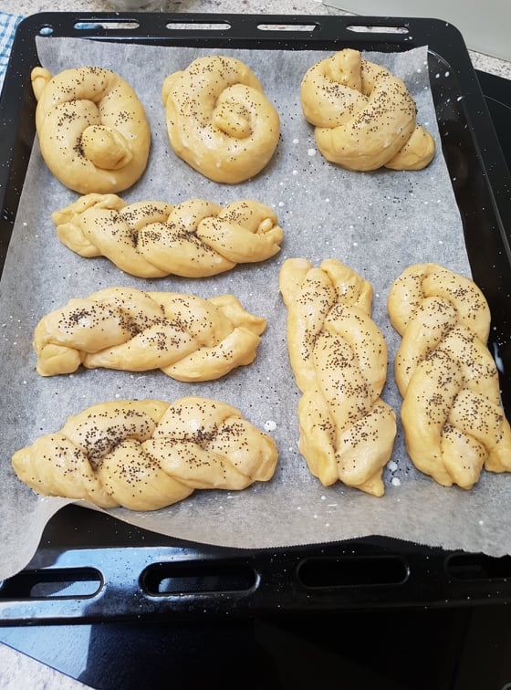

Vánočka is a traditional braided Christmas bread (from Vánoce - Christmas). I think English people would call this dough Brioche. It is soft, sweet and buttery (with only 100 of butter), flavoured with spices and raisins. There is also an unbraided variant called Mazanec which is made for Easter.

If you make one big vánočka, be careful with baking. When I baked it in my glass bakeware, it didn't bake properly and while the surface was nicely brown, the middle was still raw. You can save yourself some experimentation if you instead bake smaller vánočkas, as shown in the picture.

### Ingredients
* 100 g butter
* 200 ml milk
* 30 g yeast
* 500 g white flour
* 100 g sugar
* 2 eggs
* 1 teaspoon vanilla essence
* 50 g raisins
* 50 g almonds
* 1/2 teaspoon lemon zest
* pinch of salt
* pinch of ground nutmeg and/or other spices

### Directions

* Make starter from 100 ml milk, yeast, add a spoon of sugar and flour and leave in a warm environment.
* Mix (sieved) flour with sugar, lemon zest, spices. Add starter, the rest of milk, liquid butter, vanilla and two egg yolks. Leave egg whites for braiding. Process dough well and let rise for an hour or two at a warm place.
* Press dough to remove bug bubbles, add washed raisins and half of the chopped almonds.
* Divide dough into 8 parts and roll them into columns for braiding.
* Braiding consist of 3 layers. The first layer is formed from 4 pieces, second layer from 3 pieces and the last layer from a single piece (divided into two).
* Braid according to the [video](https://www.kucharkaprodceru.cz/jak-se-plete-vanocka-recept/)
* Rise again for 1-1.5 hours and cover with rest of the almonds.
* Bake for 180°C for 40 minutes or less.
